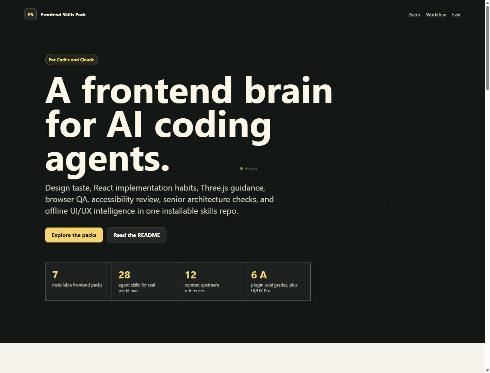

# Frontend Skills Pack for Codex and Claude

[](LICENSE)
[](.agents/plugins/marketplace.json)
[](plugins)
[](plugins)
[](plugins/frontend-ui-ux-pro)

A production-minded frontend skill pack for AI coding agents.

Give Codex or Claude a sharper frontend brain: product-grade UI direction,
React and shadcn implementation habits, Three.js/WebGL guidance, browser QA,
accessibility review, senior architecture feedback, and offline UI/UX design
intelligence.



Frontend agents can write components. This pack helps them decide what should
be built, how it should feel, and how to verify that it actually works.

## Why It Exists

Most frontend prompts fail in the same places:

- generic layouts that look like every other generated app
- buttons and forms without real states
- dashboards that show numbers but not decisions
- Three.js scenes that are blank, cropped, or broken on mobile
- React code that works once but does not fit the project
- UI reviews that miss focus, contrast, overflow, loading, and error states

This repo packages reusable frontend judgment as installable skills. It is not
a prompt dump. It is a local toolkit for design, implementation, QA, and review.

## What Is Inside

| Pack | Skills | What it gives the agent |
| --- | ---: | --- |
| `frontend-design-core` | 3 | Product UI direction, visual quality, accessibility, interface polish |
| `frontend-react-ui` | 5 | React, Next.js, shadcn, Magic UI, React Bits, component craft |
| `frontend-3d-motion` | 4 | Three.js, React Three Fiber, model viewers, animation patterns |
| `frontend-browser-qa` | 4 | Playwright, visual QA, live-site audits, debugging workflow |
| `frontend-strategy-review` | 6 | Senior frontend architecture, code review, performance, accessibility |
| `frontend-prototypes` | 5 | Dashboards, mobile screens, web prototypes, wireframes, editorial screens |
| `frontend-ui-ux-pro` | 1 | Offline UI/UX Pro Max search for design systems, styles, colors, charts, stacks |

Totals:

- 7 installable frontend packs
- 28 skills
- 12 curated upstream reference sources
- offline UI/UX data asset
- Codex marketplace support
- Claude-style `SKILL.md` folders

## Showcase

Open the local showcase:

```powershell
start .\docs\showcase.html
```

Or read the examples:

- [Examples overview](examples/README.md)
- [UI feature matrix](examples/ui-feature-matrix.md)
- [Agent workflow loop](examples/agent-workflow-loop.md)
- [Dashboard redesign prompt](examples/dashboard-redesign.md)
- [React component polish](examples/react-component-polish.md)
- [Three.js scene prompt](examples/threejs-scene.md)
- [UI audit before/after](examples/ui-audit-before-after.md)
- [Browser QA checklist](examples/browser-qa-checklist.md)

## Install For Codex

Clone the repo and install the local marketplace:

```powershell
git clone https://github.com/your-org/codex-frontend-skills.git
cd codex-frontend-skills
powershell -ExecutionPolicy Bypass -File .\scripts\install-local.ps1
```

Manual install:

```powershell
codex plugin marketplace add .
codex plugin add frontend-design-core@codex-frontend-skills
codex plugin add frontend-react-ui@codex-frontend-skills
codex plugin add frontend-3d-motion@codex-frontend-skills
codex plugin add frontend-browser-qa@codex-frontend-skills
codex plugin add frontend-strategy-review@codex-frontend-skills
codex plugin add frontend-prototypes@codex-frontend-skills
codex plugin add frontend-ui-ux-pro@codex-frontend-skills
```

Start a new Codex thread after installation so the skills are loaded.

## Use With Claude

Each skill is a normal `SKILL.md` folder with optional `scripts/`,
`references/`, and `assets/`. That makes the skill folders portable to
Claude-style custom skill workflows.

Typical Claude usage:

1. Choose the skill folder you want from `plugins/*/skills/*`.
2. Copy that folder into your Claude skills location or bundle it using your
   Claude skill workflow.
3. Keep the folder structure intact so `SKILL.md` can find its scripts and
   assets.

For a full frontend setup, start with:

- `plugins/frontend-design-core/skills/frontend-design-core`
- `plugins/frontend-react-ui/skills/frontend-component-craft`
- `plugins/frontend-strategy-review/skills/frontend-code-review`
- `plugins/frontend-ui-ux-pro/skills/ui-ux-pro-max`
- `plugins/frontend-browser-qa/skills/playwright-visual-qa`

## Example Prompts

```text
Design and implement a dense but readable analytics dashboard. Use the frontend
skills to choose layout, typography, component states, charts, and QA checks.
```

```text
Review this React page like a senior frontend engineer. Focus on architecture,
accessibility, performance, visual polish, and browser verification.
```

```text
Build a Three.js product scene that is nonblank, responsive, interactive, and
verified in desktop and mobile screenshots.
```

```text
Audit this UI for buttons, forms, focus states, loading states, text overflow,
empty states, contrast, and responsive behavior.
```

## Offline UI/UX Intelligence

`frontend-ui-ux-pro` includes a local UI/UX data asset for design-system
recommendations, style matching, typography, color palettes, charts, UX
guidelines, and stack-specific frontend advice.

It works without asking users to install Python manually in Codex Desktop:

- tries `CODEX_BUNDLED_PYTHON`
- tries Codex's bundled Python runtime
- falls back to `python` or `python3`
- extracts the data asset into a local temp cache when needed

Smoke test:

```powershell
powershell -ExecutionPolicy Bypass -File .\plugins\frontend-ui-ux-pro\skills\ui-ux-pro-max\scripts\run-search.ps1 "saas dashboard accessibility" --design-system -p "Smoke Test"
```

## React Bits

React Bits support is optional.

The large upstream archive is not committed because it is heavy and uses
MIT + Commons Clause. Fetch it only when you want local component extraction:

```powershell
powershell -ExecutionPolicy Bypass -File .\plugins\frontend-react-ui\skills\react-bits\scripts\fetch-react-bits.ps1
powershell -ExecutionPolicy Bypass -File .\plugins\frontend-react-ui\skills\react-bits\scripts\extract-react-bits.ps1 -List
```

Review upstream licensing before redistributing React Bits source or archives.

## Evaluation

Local `plugin-eval` snapshot:

| Plugin | Score | Grade | Risk |
| --- | ---: | --- | --- |
| `frontend-design-core` | 100 | A | low |
| `frontend-prototypes` | 100 | A | low |
| `frontend-react-ui` | 95 | A | medium |
| `frontend-3d-motion` | 100 | A | low |
| `frontend-browser-qa` | 100 | A | low |
| `frontend-strategy-review` | 100 | A | low |
| `frontend-ui-ux-pro` | 82 | C | medium |

Run the evaluation locally:

```powershell
powershell -ExecutionPolicy Bypass -File .\scripts\eval-all.ps1
```

`frontend-ui-ux-pro` scores lower because it includes executable Python search
logic and an offline data asset. The runtime smoke test passes.

## How This Is Different

| Single frontend prompt | This repo |
| --- | --- |
| One long instruction blob | Split packs that load only when relevant |
| Mostly visual taste | Design, React, Three.js, QA, review, architecture |
| Often internet-dependent | Core workflows work locally |
| Hard to evaluate | Plugin-level evaluation table and smoke scripts |
| Good for one task | Reusable frontend operating system for agents |

## Repository Layout

```text
.agents/plugins/marketplace.json  Codex marketplace
plugins/                          Installable frontend packs
source-packs/                     Curated upstream reference snapshot
examples/                         Copyable demo prompts and workflows
docs/showcase.html                Visual repo showcase
scripts/install-local.ps1         Local Codex install helper
scripts/eval-all.ps1              Plugin evaluation helper
```

## License And Attribution

This packaging and original glue code are MIT licensed.

Some referenced upstream projects keep their own licenses. See
[NOTICE.md](NOTICE.md) before redistributing bundled data, archives, or
third-party source material.
